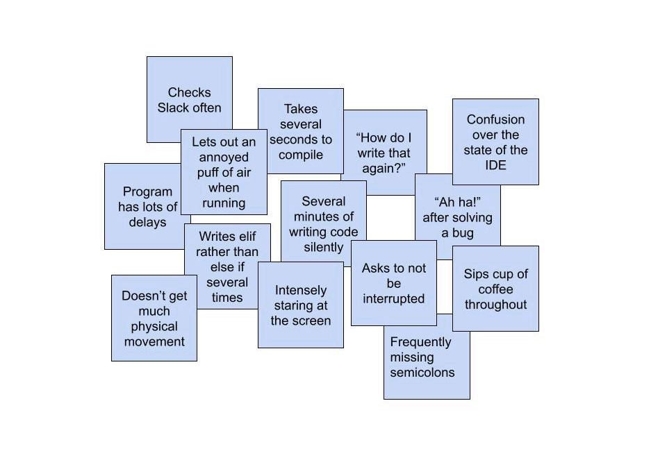

> Design Thinking
> 
> 关于面向用户的思考
> 
> 分为六个部分：
> 
> - Empathize: 共情
> - Define: 根据调查、观察的信息组织、思考问题的所在（归类总结、结构化）
> - Ideate: 大胆提出想法
> - Prototype: 设计Demo
> - Test
> - Implement

# Empathize

> Conduct research to develop an understanding of your users.
> 

## How do we empathize with users?

- 把握其需求、偏好与期望。重点考察用户的行为模式、语言表达、思维逻辑及情感体验
- Methods to build empathy: think-aloud, ethnography, diary studies, cultural probes... (Check CS570!)

## the method contextual inquiries

1. Go to where the customer works or lives.
2. Observe the customer as they work.
3. Talk to the customer about their work.

> take notes
>
> These can be direct quotes, general observations, notes about the environment, or anything else of interest and valuable to your research

**Tips**
- 询问而非采访
- The user is the master, you are an apprentice.
- 提问，不要偏离任务，非干扰式交流，开放式提问
- 关注对方在做什么

# Define

> Combine all your data and derive where your users' problems exist.

1. 聚集发现
2. 整合、分类、提炼
3. 获得洞察

## Affinity Diagramming

1. 从许多杂乱的笔记开始。
2. 根据“相似性”将笔记分组。
3. 与你的团队讨论分组情况。
4. 如有必要，重新组织！
5. 为每个组确定一个共同主题。

从无序

到有序

# Ideation

> 关键在于可以迭代

## IDEO's Rules of Engagement

1. 不要急于评断
2. 鼓励wild idea
3. Build on the ideas of others.
4. 聚焦主题
5. 有序对话（One conversation at a time.）
6. 视觉化
7. 追求数量

## Sketching(草图)
Everyone can sketch.

Sketching is more effective than words for most ideas.

Quick and inexpensive sketches do not inhibit exploration.

Sketches are disposable.强调过程而非结果

1. 草图是在需要时即兴绘制的，即时发生。
2. 草图应该很多，包含大量想法，并且每个想法都应该有多张草图。
3. 文本注解可以解释草图中发生了什么。

## Storyboarding

> A sequence of visual frames that illustrate user interaction with the envisioned system, capturing social, environmental, and technical factors that shape user experience.

时序性：6-12帧的连续叙事结构

情境维度：包含社会环境、技术条件、物理环境等要素

交互焦点：突出用户与系统的动态关系

